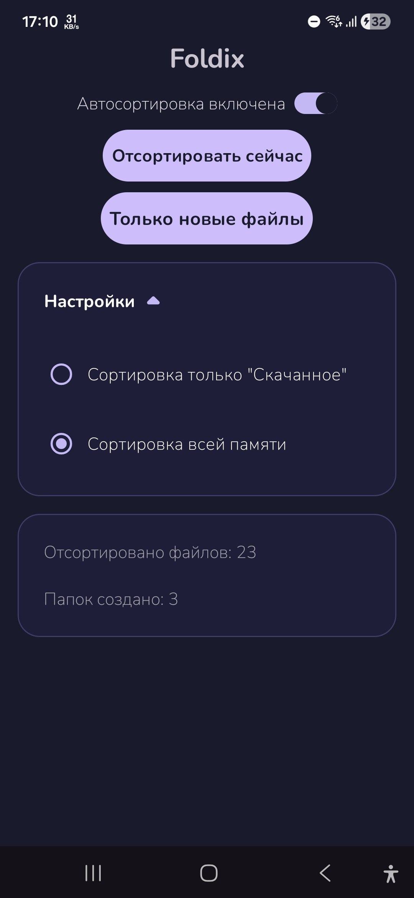
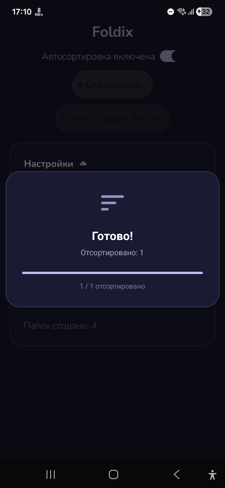
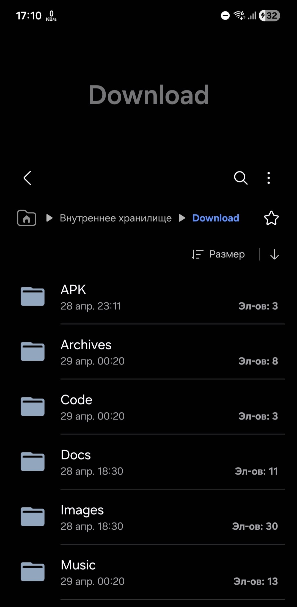

# Foldix 📁

**Автоматический сортировщик файлов для Android**

Foldix следит за вашими файлами и автоматически раскладывает их по папкам в зависимости от типа. Никакой рекламы, никаких аккаунтов, никакого облака — всё локально.

---

## Как это работает

Android скачивает всё в одну папку `Downloads` без разбора — APK, фото, архивы, документы. Foldix запускает фоновый сервис и при появлении нового файла автоматически перемещает его в нужную подпапку.

```
Downloads/
├── APK/          → .apk
├── Images/       → .jpg .jpeg .png .webp .gif
├── Video/        → .mp4 .mkv .avi .mov
├── Music/        → .mp3 .flac .aac .wav
├── Archives/     → .zip .rar .7z .tar
└── Docs/         → .pdf .doc .docx .txt
```

---

## Возможности

- **Автосортировка в реальном времени** - новые файлы сортируются сразу при появлении
- **"Отсортировать сейчас"** - ручная сортировка всех существующих файлов
- **"Только новые файлы"** - следит только за новыми, старые не трогает
- **Два режима** - только папка Downloads или вся память устройства
- **Запуск при загрузке** - сервис стартует автоматически после перезагрузки
- **Без рекламы** - полностью бесплатно и без слежки

---

## Установка

1. Скачай APK из [Releases](https://github.com/DSD-dev/Foldix/releases/download/APK/Foldix.apk)
2. Разреши установку из неизвестных источников
3. При первом запуске выдай разрешение на управление файлами
4. Готово

---

## Скриншоты







Требования:
- minSdk 21
- targetSdk 34
- compileSdk 34

Зависимости:
- `com.google.android.material:material:1.13.0`
- `androidx.appcompat:appcompat`
- `androidx.core:core`

---

## Разрешения

| Разрешение | Зачем |
|---|---|
| `MANAGE_EXTERNAL_STORAGE` | Доступ к файлам на Android 11+ |
| `READ_MEDIA_IMAGES/VIDEO/AUDIO` | Доступ к медиафайлам на Android 13+ |
| `READ/WRITE_EXTERNAL_STORAGE` | Доступ к файлам на Android 10 и ниже |
| `FOREGROUND_SERVICE` | Фоновый сервис сортировки |
| `RECEIVE_BOOT_COMPLETED` | Автозапуск после перезагрузки |

---

## Совместимость

- Android 5.0+ (API 21)
- Протестировано на Android 11, 13, 14, 16

---
